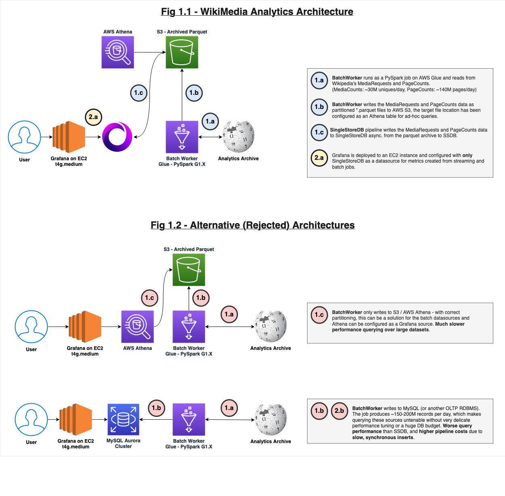

# Wikipedia Analytics on Singlestore

This repo contains the source code for my [submission](https://stats.morespinach.xyz) to the SingleStore 2022 Hackathon. The project uses SingleStore as a database for storing and calculating statistics on Wikipedia's engagement. I sink both streaming sources (e.g. Wikipedia's recent edits log) and batch sources (e.g. hourly pageview records) to SingleStore and use Grafana as a public interface for visualizing this data.
	
## Usage

This repo provisions a Grafana instance with two dashboards for users to interact with, each panel comes with a detailed description of what it displays; a summary of the provisioned panels is shown below:

**Table 1.0 - Panels Provisioned**
| Panel                                          | Frequency | Dashboard   |
|------------------------------------------------|-----------|-------------|
| Page Counts - Total Page Views                 | Hourly    | Athena Demo |
| Page Counts - Total Page Views (By Project)    | Hourly    | Athena Demo |
| Page Counts - Total Page Views                 | Hourly    | SingleStore |
| Page Counts - Total Page Views (By Project)    | Hourly    | SingleStore |
| Media Counts - Total Bytes Served              | Daily     | SingleStore |
| Media Counts - Total Bytes Served (By Project) | Daily     | SingleStore |

Users can login to the Grafana instance at `https://stats.morespinach.xyz`; read-only credentials (U: `reader` , PW: `Bothus[dot]Lunatus`) are required to authenticate on first visit.

# Architecture

This project performs batch and streaming ingestion into SingleStore.
- Batch jobs use [Apache Spark](https://spark.apache.org/) running on [AWS Glue](https://aws.amazon.com/glue/features/) to write Wikipedia's [Page Views](https://dumps.wikimedia.org/other/pageviews/readme.html) and [Media Requests](https://dumps.wikimedia.org/other/mediacounts/readme.html) to SingleStore (and archive in S3).

- Streaming jobs use a small golang program (see: `./src/main.go`) to write events from Wikipedia's [Recent Changes](https://stream.wikimedia.org/v2/ui/#/) endpoint to SingleStore.

The full system architecture, including some proposed (but eventually rejected) architectures are shown below:

